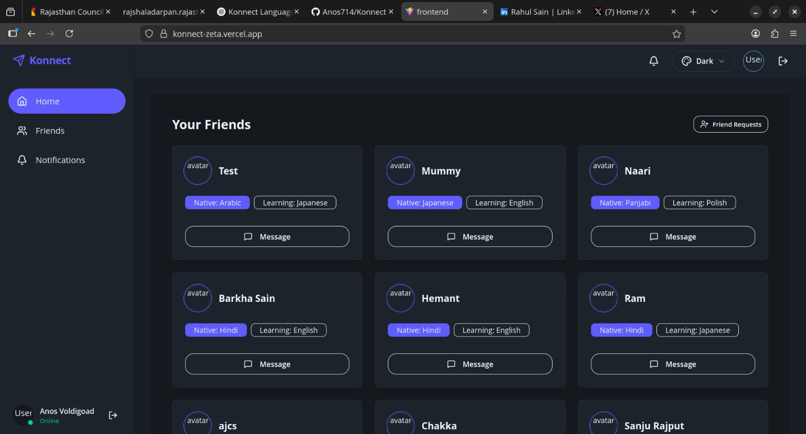
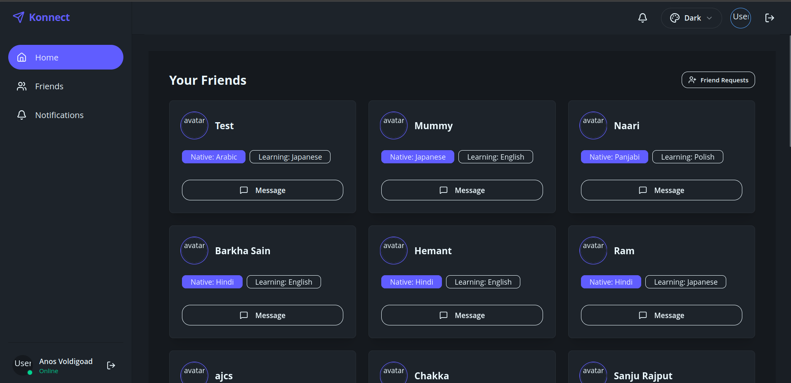
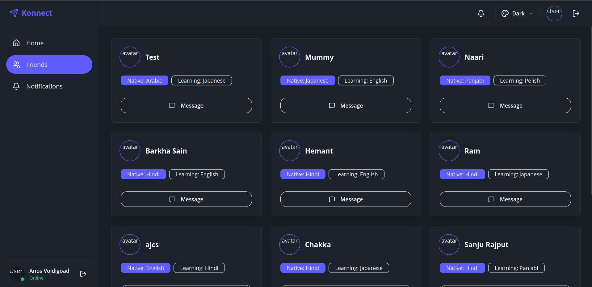
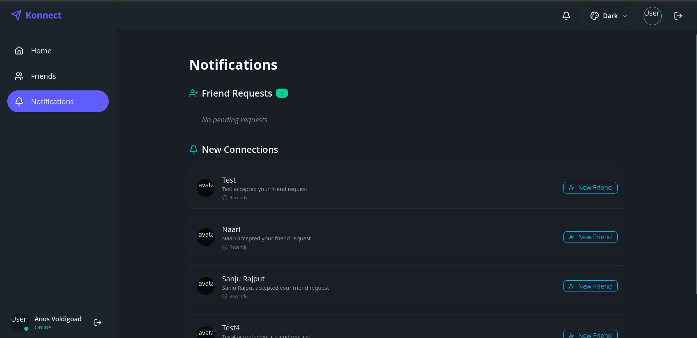
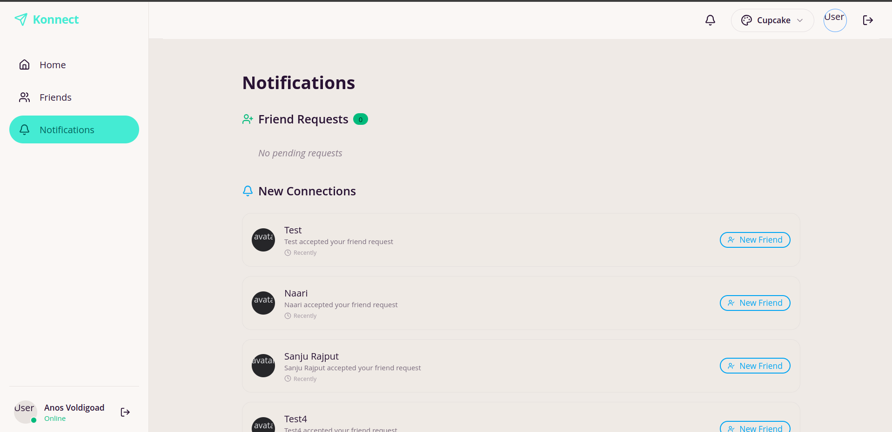
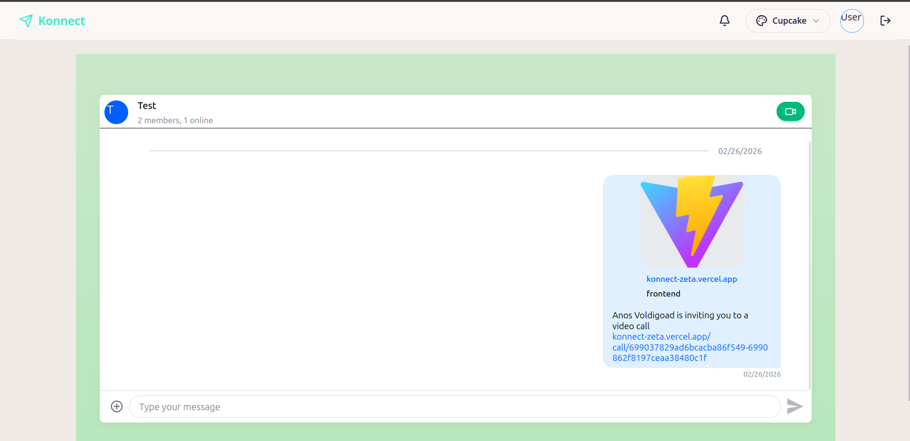
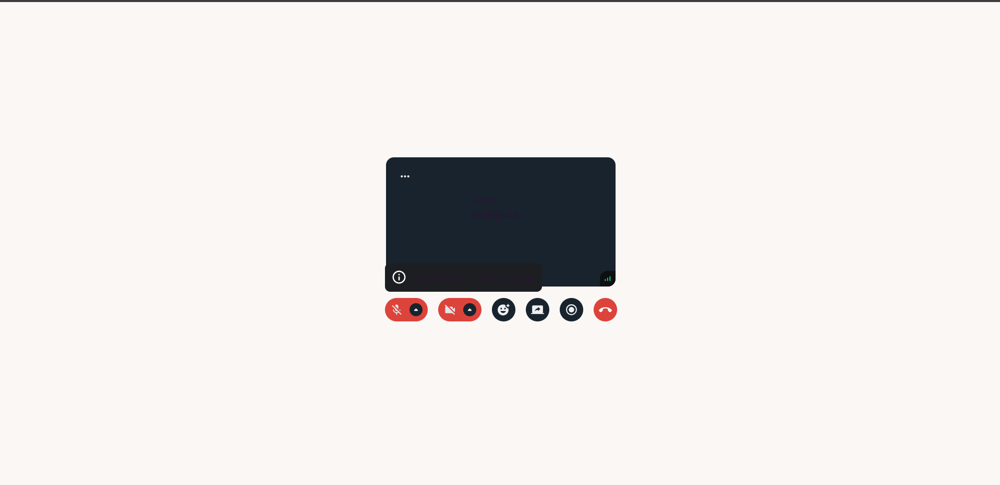
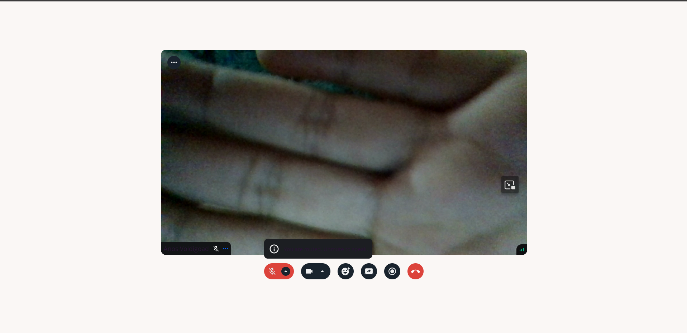

# Konnect 🌍

**Konnect** is a real-time language learning platform that connects strangers across the world to learn each other’s languages through direct conversation.

Instead of traditional courses, Konnect focuses on **human interaction** — users onboard, choose their native and learning languages, and get matched with other users for mutual learning via **chat and video calls**.

---

## 📸 Screenshots

<p align="center">
  
  
  
  
  
  
  
  
</p>

---

## 🚀 Features

- 🌐 **Language Matching System**
  - Users select:
    - Native language
    - Language they want to learn
  - Smart pairing with compatible users

- 🤝 **Friend Request System**
  - Send/accept requests before starting conversations
  - Build a network of language partners

- 💬 **Real-time Chat**
  - Instant messaging using Stream Chat

- 📹 **Video Calling**
  - Face-to-face learning using Stream Video SDK

- 🔐 **Authentication & Security**
  - JWT-based authentication
  - Password hashing with bcrypt

- ✅ **Form Validation**
  - Robust validation using Joi (backend) & Zod (frontend)

---

## 🛠️ Tech Stack

### Backend

- **Node.js + Express**
- **MongoDB + Mongoose**
- **TypeScript**

#### Key Libraries:

- `bcryptjs` – Password hashing
- `jsonwebtoken` – Authentication
- `joi` – Request validation
- `stream-chat` – Chat integration
- `cors`, `cookie-parser`, `dotenv`

---

### Frontend

- **React 19 + Vite**
- **TypeScript**
- **TailwindCSS + DaisyUI**

#### Key Libraries:

- `react-router` – Routing
- `react-query` – Server state management
- `zustand` – Global state
- `react-hook-form + zod` – Forms & validation
- `axios` – API calls
- `stream-chat-react` – Chat UI
- `@stream-io/video-react-sdk` – Video calls
- `react-hot-toast` – Notifications
- `lucide-react` – Icons

---

## 🧠 How It Works

1. User signs up and logs in
2. Selects:
   - Native language
   - Language to learn
3. Platform suggests matching users
4. Users send friend requests
5. Once accepted:
   - Start chatting 💬
   - Or jump into video calls 📹
6. Learn naturally through conversation

---

## ⚡ Key Challenges Solved

- Real-time communication (chat + video)
- Matching users based on language preferences
- Secure authentication flow
- Managing global and server state efficiently
- Handling asynchronous UI with React Query

---

## 📁 Project Structure (Simplified)

```bash
Konnect/
│
├── backend/
│   ├── src/
│   │   ├── controllers/        # Request handlers (auth, user, chat, etc.)
│   │   ├── models/             # Mongoose schemas
│   │   ├── routes/             # Express routes
│   │   ├── middleware/         # Auth, error handling, validation
│   │   ├── utils/              # Helper functions / services
│   │   ├── config/             # DB & third-party configs
│   │   └── index.ts            # Entry point
│   │
│   ├── .env                    # Environment variables
│   ├── package.json
│   └── tsconfig.json
│
├── frontend/
│   ├── src/
│   │   ├── components/         # Reusable UI components
│   │   ├── pages/              # Route-level pages
│   │   ├── hooks/              # Custom React hooks
│   │   ├── store/              # Zustand state management
│   │   ├── services/           # API calls (axios)
│   │   ├── lib/                # Configs (query client, utils, etc.)
│   │   ├── routes/             # App routing setup
│   │   ├── types/              # TypeScript types
│   │   ├── App.tsx
│   │   └── main.tsx
│   │
│   ├── public/
│   ├── index.html
│   ├── vite.config.ts
│   ├── package.json
│   └── tsconfig.json
│
├── README.md
└── .gitignore
```

## ⚙️ Setup Instructions

### 1. Clone the Repository

```bash
git clone https://github.com/Anos714/Konnect.git
cd konnect
```

### 2. Backend Setup

```bash
cd backend
npm install
```

#### Create a .env file in the backend directory:

```bash
PORT=8080
MONGO_URI=your_mongodb_uri

# stream_services
STREAM_API_KEY=your_stream_api_key
STREAM_API_SECRET=your_stream_api_secret


# jwt secrets
JWT_SECRET_ACCESS=your_jwt_access_token_secret
JWT_SECRET_REFRESH=your_jwt_refresh_token_secret

# node env
NODE_ENV=development
HOST_URL=http://localhost:5173
```

#### Start the backend server:

```bash
npm run dev
```

### 3. Frontend Setup

```bash
cd frontend
npm install
npm run dev
```

#### Create a .env file in the frontend directory:

```bash
VITE_BASE_URL=http://localhost:8080/api/v1
VITE_STREAM_API_KEY=your_stream_api_key
```

#### Start the frontend server:

```bash
npm run dev
```
